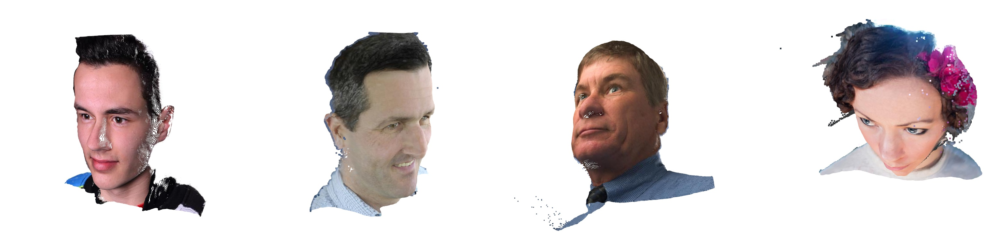

# FaceDepth

A deep learning model for high-quality face depth estimation using DINOv3 and custom decoder architecture.

<p align="center">
  
</p>


## Installation

### Requirements

- Python 3.8+
- CUDA 11.0+ (for GPU support)
- PyTorch 2.0+

### Setup

```bash
git clone https://github.com/jseobyun/FaceDepth.git
cd FaceDepth
pip install -r requirements.txt
```


Download pretrained weights:
   - DINOv3 weights: Place in `checkpoints/dinov3_vitl16_pretrain_lvd1689m-8aa4cbdd.pth`
   - Decoder weights: Place in `experiments/checkpoints/decoder.ckpt`

#### DINOv3 Weights
The DINOv3 weights (`dinov3_vitl16_pretrain_lvd1689m-8aa4cbdd.pth`) are from the official DINOv3 repository and should be downloaded separately:
- Source: [Official DINOv3 Repository](https://github.com/facebookresearch/dinov3)
- Model: ViT-L/16 pretrained on LVD-1689M dataset
- Place the weights in: `checkpoints/dinov3_vitl16_pretrain_lvd1689m-8aa4cbdd.pth`

#### Decoder Weights
Only the [decoder weights](https://drive.google.com/file/d/1IycwybMnUWOs3TWrKt4AY9fCdbbt-jY-/view?usp=drive_link) are provided in this repository (`experiments/checkpoints/decoder.ckpt`). These weights include:
- Custom decoder layers
- VGG19 CNN encoder (pretrained and fine-tuned)
- All training-specific parameters

## Usage

### Inference

Run depth estimation on a single image or directory:

```bash
# Single image
python inference.py --input_dir path/to/image.jpg --output_dir outputs/

# Directory of images
python inference.py --input_dir path/to/images/ --output_dir outputs/ --batch_size 4

# With custom settings
python inference.py \
    --input_dir path/to/images/ \
    --output_dir outputs/ \
    --checkpoint experiments/checkpoints/decoder.ckpt \
    --dinov3_checkpoint checkpoints/dinov3_vitl16_pretrain_lvd1689m-8aa4cbdd.pth \
    --image_size 512 512 \
    --save_visualization \
    --cmap jet
```

### Training

Train the model with your own data:

```bash
# Using configuration file
python train.py --config configs/default_config.yaml

# Resume training
python train.py --config configs/default_config.yaml --resume_from path/to/checkpoint.ckpt
```

### Configuration

Edit `configs/default_config.yaml` to customize:
- Data paths and augmentation
- Model architecture parameters
- Training hyperparameters
- Callbacks and logging

## Model Architecture

### Components

1. **Encoder**:
   - DINOv3 ViT-L/16 backbone for feature extraction
   - CNN branch for multi-scale features
   - Feature fusion module

2. **Decoder**:
   - Progressive upsampling with skip connections
   - Multi-scale feature aggregation
   - Output: 2-channel prediction (depth + mask)

3. **Visualization**:
   - Depth map colorization
   - Point cloud generation
   - Side-by-side comparisons

## Output Files

For each input image, the model generates:
- `*_mask.png`: Binary face mask
- `*_visualization.png`: Side-by-side visualization with depth colormap
- Point cloud display (interactive)

## Project Structure

```
FaceDepth/
├── configs/              # Configuration files
│   └── default_config.yaml
├── src/
│   ├── models/          # Model architecture
│   │   ├── dinov3/      # DINOv3 implementation
│   │   ├── encoder.py
│   │   ├── decoder.py
│   │   └── face_depth_model.py
│   ├── data/            # Data loading and processing
│   └── utils/           # Utilities and visualization
├── experiments/         # Training outputs
├── checkpoints/         # Pretrained weights
├── train.py            # Training script
├── inference.py        # Inference script
└── requirements.txt    # Dependencies
```

## License

This project is licensed under the MIT License - see the LICENSE file for details.

## Acknowledgments

- DINOv3 team for the vision transformer backbone
- Open3D for 3D visualization tools
- PyTorch Lightning for training framework